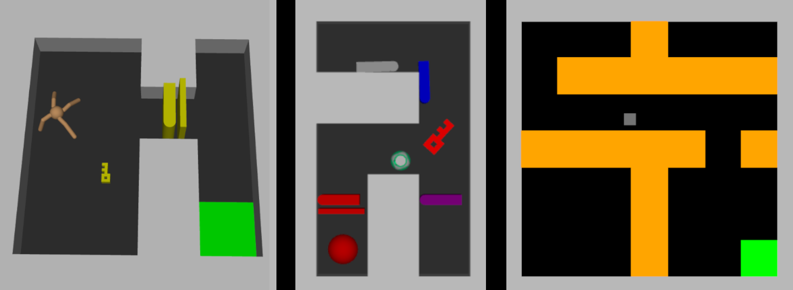

# CocoGrid

<!--  -->


A continuous control RL environment that extends the discrete gridworld [Minigrid](https://github.com/Farama-Foundation/Minigrid) to a continuous action and observation space. Cocogrid supports both 2D and 3D physics with [Box2D](https://pypi.org/project/Box2D/) and MuJoCo ([dm_control](https://github.com/google-deepmind/dm_controlhttps://)). Supports many grid configurations, multiple objects, and custom tasks. It is easily extensible.

## Installation

```bash
$ git clone https://github.com/Intelligent-Reliable-Autonomous-Systems/CocoGrid
$ cd cocogrid
$ pip install -e .
```

The OpenGL options for `$MUJOCO_GL` and `$PYOPENGL_PLATFORM` are `osmesa` (software rendering), `glfw` (windowed rendering), and `egl` (windowless hardware-accelerated rendering). `egl` is ideal with a GPU, but can be tricky to set up.

## Instantiation

A cocogrid environment can be instantiated with `gymnasium.make`.

```python
import gymnasium
env = gymnasium.make('Cocogrid-Empty-5x5-v0', timesteps=500)
```

Cocogrid supports the following parameters:

- **`agent`**: `str | Agent | type[Agent]` (default `'mujoco/ball'`)
  
  - What type of agent should be placed in the environment. More details about each below.
  - Values: `mujoco/square`, `mujoco/ball`, `mujoco/ant`, `box2d`
- **`observation`**: `str | ObservationSpecification` (default `'no-arena'`)
  
  - What observations should be returned from the environment. 
  - Values:
    - `full`: Return all observations concatenated as a vector, including the flattened grid.
    - `no-arena`: Return agent and object observations concatenated as a vector, but omit the grid.
    - `object-one-hot`: All observations are returned as a vector, and object types, colors, and states are one-hot encoded instead of ordinal.
  - More observation combinations can be composed with `ObservationSpecification`.
- `xy_scale`: `float` (default `1`)
  
  - How big each grid unit should be. This changes the size of the walls, but not the size of the agent or objects.
  - Values: xy_scale >= 1
  - Some agents have a minimum scale.
- `timesteps`: `int` (default `500`)
  
  - How many steps to run before terminating the episode.
  - Values: any int >= 1
- `task_function`: `cocogrid.tasks.TaskEvalType` (default `None`)
  
  - A function to evaluate states for task completion or failure.
  - This overrides `get_task_function` to use the same task_function for every episode. 
  - The task function takes in the previous and current arena states and outputs a tuple of (reward, terminate).
  - Value: a function of the form `def my_task_function(prev_state: CocogridState, current_state: CocogridState) -> tuple[float, bool]`
- `get_task_function`: `cocogrid.tasks.TaskGetterType` (default `None`)
  
  - A function to get the task evaluator for each episode. Takes a Minigrid environment as input and returns a task evaluator function.
  - Value: a function of the form `def my_get_task_function(minigrid: minigrid.minigrid_env.MiniGridEnv) -> tuple[cocogrid.tasks.TaskEvalType, str]`
  - If `None`, will be inferred from `type(minigrid_env)`.
- `spawn_position` (default `None`)
  
  - If specified, sets the position of the agent to a fixed position at the start of each episode.
  - Values: a (x,y) or (x,y,z) tuple.
- `spawn_sampler` (default `None')
  
  - If specified, this function will be called at the start of an episode to return a spawn position. `spawn_position` takes precedence.
- `random_spawn` (default `False`) [MuJoCo only]
  
  - If `True`, spawns the agent in a random location (avoiding walls).
- `random_rotation` (default `False`) [MujoCo only]
  
  - If `True`, spawns the agent in a random orientation each episode. `spawn_position` and `spawn_sampler` take precedence.

## Environments

All CocoGrid environments are derived from a `minigrid.minigrid_env.MinigridEnv` instance. A full list and description can be found at https://minigrid.farama.org/environments/minigrid/. Several custom Minigrid environments are provided:
- DoorKeyCrossingEnv: Modifies SimpleCrossingEnv to have a locked door and key.
- HallwayChoiceEnv: Navigate down a corridor, then choose up or down to reach a randomly placed goal.
- ObjectDelivery: An empty room is populated by objects and a goal. A selected object must be delivered to the goal.
- RandomCorner: Agent is spawned in the center. A goal is randomly placed in one of the corners.
- UMaze: Agent must navigate around a U-bend to reach the goal.

## Utility

For convenient testing, there is a utility command `cocogrid` (or `python -m cocogrid`). These are the subcommands:

- `list`, `l`: list the available cocogrid environment ids.
- `gym`, `g`: spawn an interactive window with keyboard input.
- `interactive`, `i`: For MuJoCo agents, spawn a 3D interactive window.
- `minigrid`, `m`: spawns an interactive window for a grid world.
- `detail`, `d`: give details about the selected environment.
- `framerate`, `f`: test the steps-per-second of the environment.

And these are the parameters you can pass into the utility:

- General environment arguments:
  - `--env <str>`, `-e <str>`: Select the environment id. "Cocogrid-" can be truncated (e.g. "DoorKey-6x6" gives "Cocogrid-DoorKey-6x6-v0").
  - `--agent <str>`, `-a <str>`: Select the `agent` type.
  - `--obs <str>`, `-o <str>`: Select the `observation` type.
  - `--scale <float>`, `-s <float>`: Select the `xy_scale`.
  - `--timesteps <int>`, `-t <int>`: Select the `timesteps`.
  - `--seed <int>`: Select the Minigrid `seed` to fix the procedural generation.
- `gym` arguments:
  - `--episodes <int>`: The number of episodes to run in `--gym` before exiting
  - `--print-obs`: For debugging, print the observations in `--gym`
  - `--print-reward`: For debugging, print the reward in `--gym`
- `list` arguments:
  - Comma separated filter keywords (supports negations with `^`). For example, `cocogrid list "key,^door"`.
  - `--sensitive`, `-s`: Make filter case sensitive.
  - `--vertical`, `--vert`, `-v`: Display each result on a new line.
- `framerate` arguments:
  - `--num-tests <int>`: The number of tests to run.
  - `--num-steps <int>`: The number of steps to run each test for.
  - `--sync-vec <int>`: If specified, will run a SyncVectorEnv with n envs.
  - `--async-vec <int>`: If specified, will run a AsyncVectorEnv with n envs (may be non-functional).
Examples:

```bash
$ cocogrid gym -e Cocogrid-SimpleCrossingS9N3-v0 -w mujoco/ball -t 1000
```

```bash
$ cocogrid detail -e Cocogrid-KeyCorridorS3R2-v0
```


